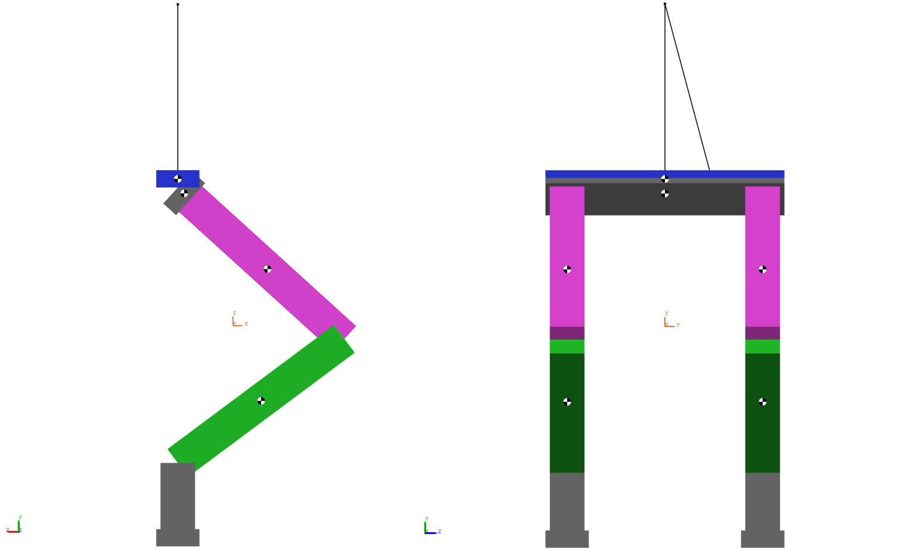
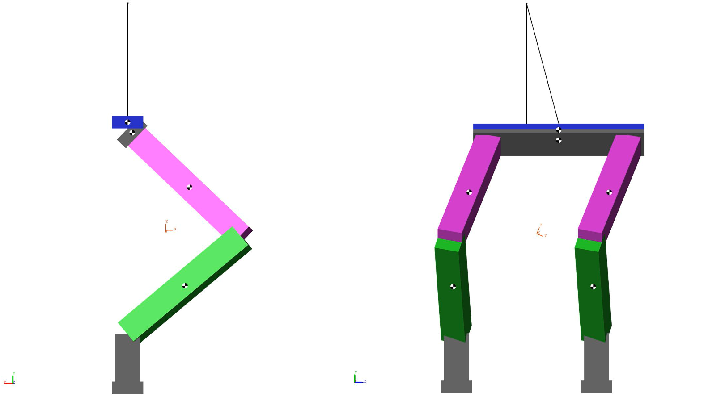
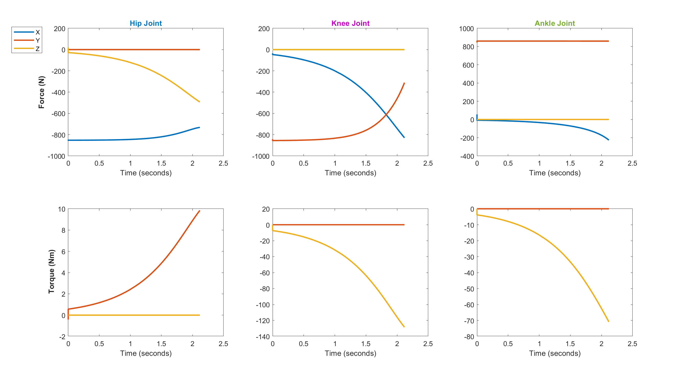
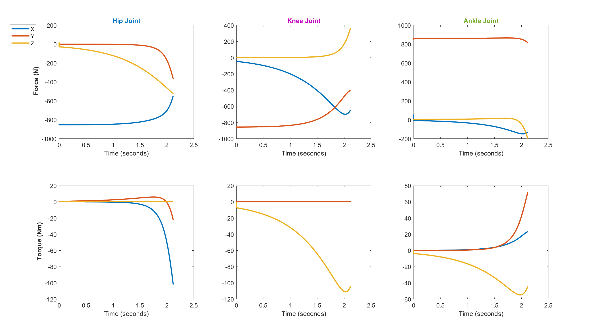
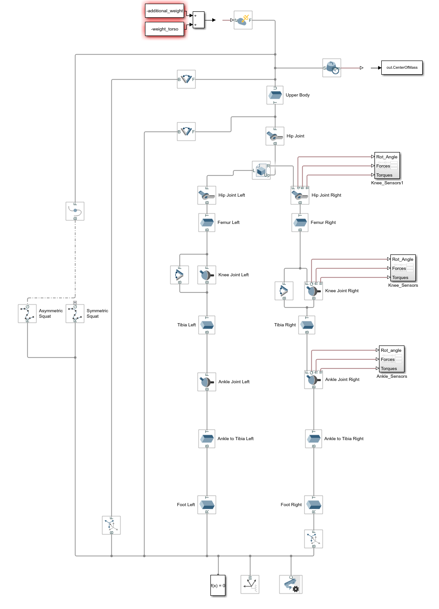

<!-- PROJECT LOGO -->

<h1 align="left"><b>Humanoid Robot Squat Analysis</b></h1>

<!-- ABOUT THE PROJECT -->
## About The Project

The goal of the project is to get reaction forces and torques at the legs' joints of a humanoid robot while performing a _symmetric_ and _asymmetric_ squat.
The torso of the robot is considered as a vertical distruibuted force of 300N.

A _symmetric squat_ consists of a squat where all the leg's joints actuate at the same time and with the same displacement, thus keeping the torso parallel to the ground.

An _asymmetric squat_ consists of a squat where all the leg's joints actuate at the same time but with different displacements, thus the torso won't be parallel to the ground anymore.

(<a href="#readme-top">back to top</a>)

<!-- GETTING STARTED -->
## Getting Started

Clone the repo on your device or donwload it in a folder.

### Prerequisites

You must have installed:

* <a ref="https://it.mathworks.com/products/matlab.html">Matlab 2021 or newer</a>
* <a ref="https://it.mathworks.com/products/simulink.html">Simulink</a>
* <a ref="https://it.mathworks.com/products/simscape-multibody.html">Simscape Multibody Plug-in</a>

<!-- USAGE EXAMPLES -->
## Usage
In order to make it work and get the actions at the joints, you must follow the following steps:
1. Open Robot_model.slx;
2. Open and Run the first section of plots.mlx;
3. Run Robot_model.slx;
4. Run the second section of plots.mlx

(<a href="#readme-top">back to top</a>)

<!-- ROADMAP -->
## Roadmap

- [x] Implement symmetric squat movement of one leg
- [x] Implement symmetric squat movement of both legs
- [x] Plot reaction forces at the joints
- [x] Implement asymmetric squat
- [x] Add variable upper weight and spherical joints
- [x] Simulate and retrieve motors' torques

(<a href="#readme-top">back to top</a>)

<!-- RESULTS -->
## Results
The plots of the reaction forces at the joints for symmetric and asymmetric squats are presented.

_Symmetric Squat Plots_

_Asymmetric Squat Plots_

_Simscape model_

(<a href="#readme-top">back to top</a>)

### Built With

(<a href="#readme-top">back to top</a>)

